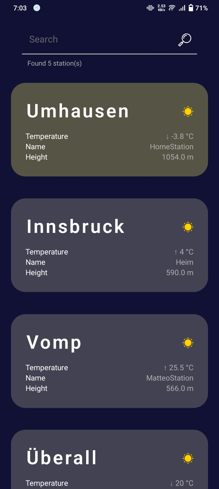
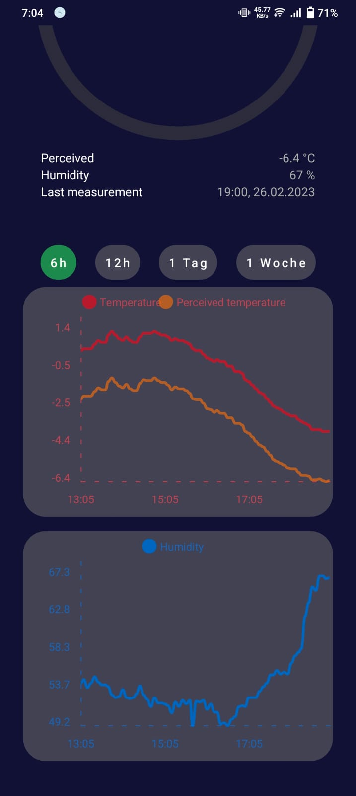
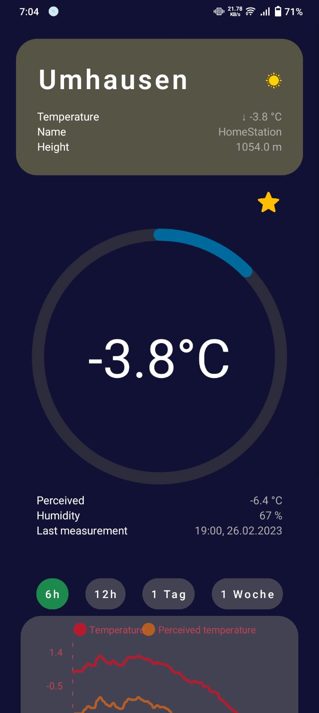

# Weather App

<br>

<div align="center">
    <a>
        
        <br/>
    </a>
    <a>
        
        <br/>
    </a>
    <a>
        
        <br/>
    </a>
    <a>
        
        <br/>
    </a>
</div>

<br>

***
This Android app gives quick and easy access to the data from [HomeDBApi](https://github.com/Nilusink/HomeDBApi/),
while also providing a visually pleasing UI.

<br>

<p align="center" width="100%">
    
    &nbsp;&nbsp;&nbsp;&nbsp;&nbsp;&nbsp;&nbsp;&nbsp;&nbsp;&nbsp;&nbsp;&nbsp;&nbsp;&nbsp;
    
    <br/><br/>
    
</p>

<br/><br/>

# Adding your own weather station
This app relies on a network of self-hosted weather stations, so any additions will be more than welcome! Creating the weather stations can be done as [described in this repo](https://github.com/Nilusink/ESPWeatherFirmware). For the `station id` and `station secret`, you can [send me an email](mailto:support@nilus.ink) containing your stations `position`, `height` (from sea level) and an unique `name`.

<br/><br/>

# Building

If you want to build this project yourself, you will first need to clone this repository to your local drive:
```bash
git clone https://github.com/Nilusink/WeatherApp && cd WeatherApp
```

<br/>

Now you need to install all of the node packages. You can either do this using `yarn` or `npm`:
```bash
yarn install
```
or
```bash
npm -i
``` 

<br/>

## Android
In case you want to build for android, run following command:
```bash
eas build --platform android
```
All you need to do now is wait for the build to finish. The `apk` file can then simply downloaded and installed to your phone.


<br>

## IOS
Building for IOS is a bit more complicated, since you need to log into your **Apple Developer Account** to do so. Also, installing the application requires XCode and needs to be updated every week.
```bash
eas build --platform ios
```
