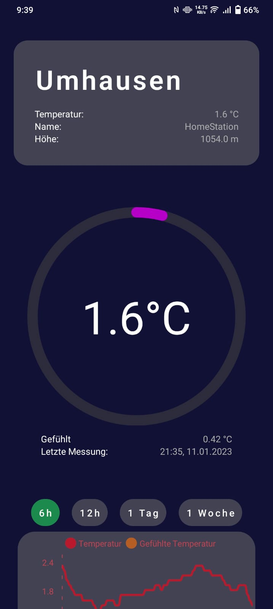
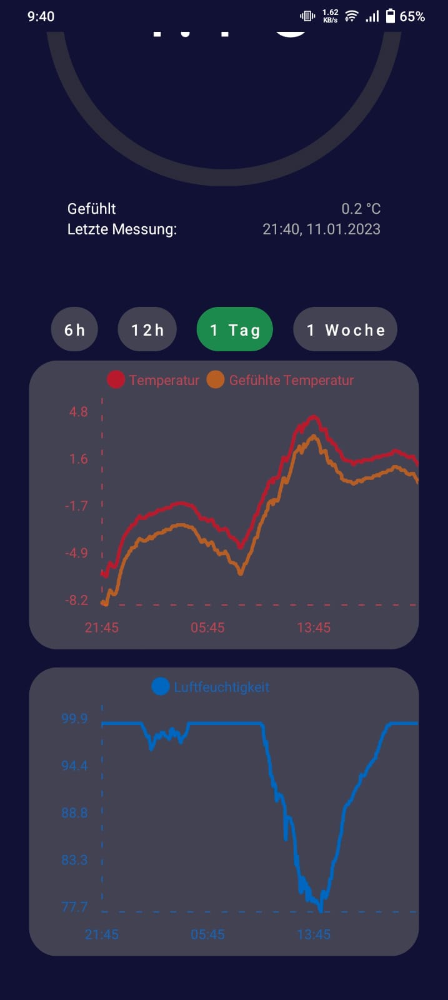

# Weather App
This Android app gives quick and easy access to the data from [HomeDBApi](https://github.com/Nilusink/HomeDBApi/),
while also providing a visually pleasing UI.

 

    
    &nbsp;&nbsp;&nbsp;&nbsp;&nbsp;&nbsp;&nbsp;&nbsp;&nbsp;&nbsp;&nbsp;&nbsp;&nbsp;&nbsp;
    

